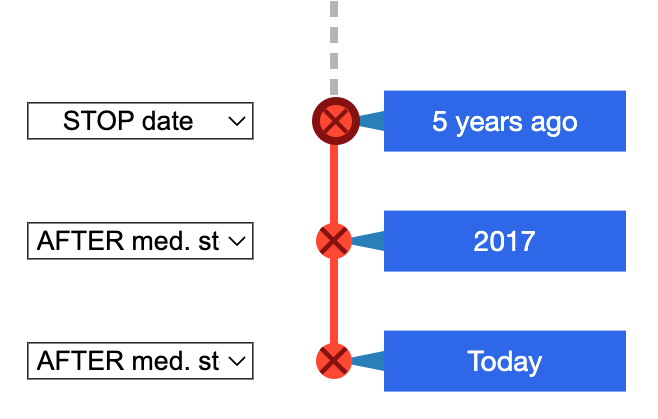
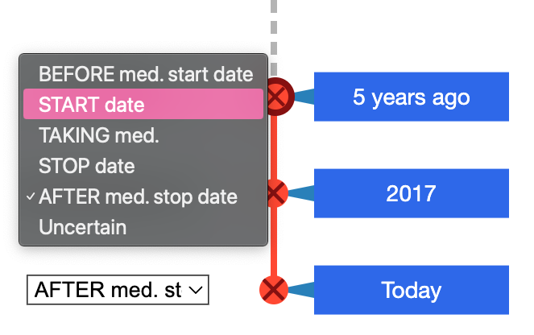
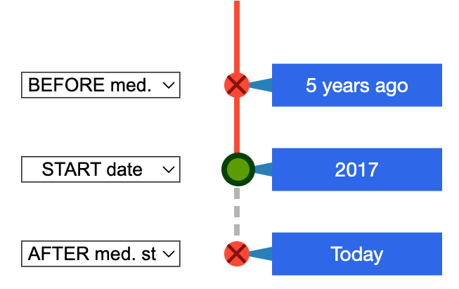
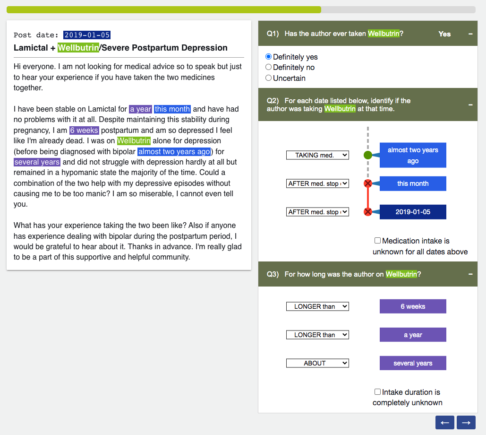

# Medication-Timeline Annotation UI

This repository contains an annotation UI to label self-reported medication timelines in social media posts.
The tool was created for crowdsourcing on AWS Mechanical Turk, but can be adapted for use on other platforms.

~~You can try it out on this [demo site]().~~ Demo site is under construction.

To run locally: `$ python app.py`

## Temporal Relations

This task defines entity-timeline annotation as a chronological series of temporal relation labels (e.g. *Before*, *On*, *After*..) for (Entity, Date) tuples. This tool is specialized for the medication-timelines, but the general framework can be applied to other domains.

It is typically challenging to obtain dense and complete relation graphs due to the steep learning curve and worker-fatigue induced from the task complexity. 
This UI was designed with these challenges in mind, and utilizes an intuitive timeline visualization that increases annotation efficiency while reducing cognitive load.
- **Dynamic temporal reasoning** to ensure the timeline is valid 
    
    i.e. I can't *stop* a medication before I *start* it.
- **Automatically label propogation** after every update to the timeline

    i.e. if I *stopped* the medication in *2015*, then it can be deduced that *2020* was definitely *after* my medication intake.

  

## Input Data
1. Text
2. Set of entities and their corresponding mentions in the text.
3. Set of time-expressions in the text (following the [TimeML](http://timeml.org/site/publications/timeMLdocs/timeml_1.2.1.html) specification).

## Screenshot
